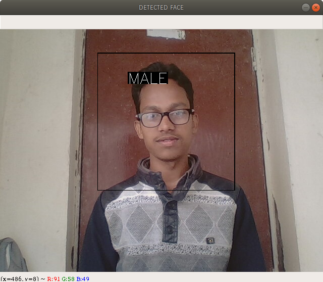
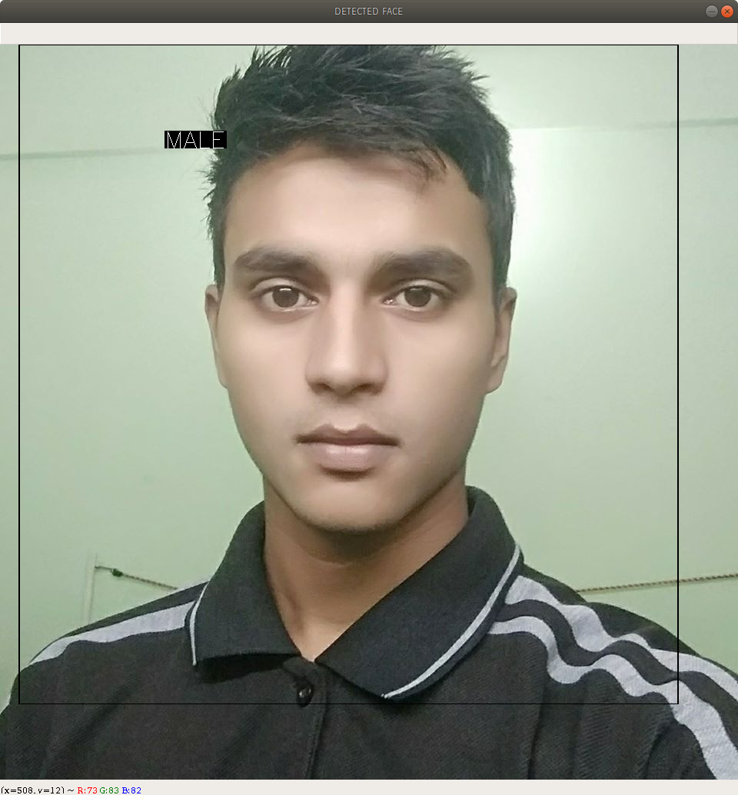
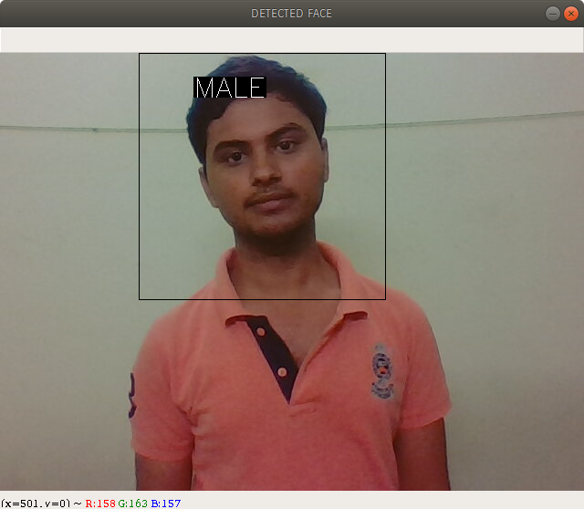

# Gender_Classifier-OpenCv-and-CNN
## Lets get walk threw this project
#### First let's have a taste of my code

So here i have used Haarcascade model for face detection and an CNN model to classify the gender.

I have used a trained model which here https://drive.google.com/file/d/10KjBUrRb0OwPzMX29nU8M2vsv1CVkmeP/view?usp=sharing you can download it, the haarcascade i use is availible over the official git repository of the OpenCv.

I have found two tutorial which are quite fascinating on this topic.

### 1. @joelbarmettlerUZH 

https://medium.com/swlh/gender-classifier-with-tensorflow-164b62a3557e

Shows really promising outcomes but take 2 days of time to train the CNN model which is using tensorflow framework.

### 2. @ krishnaik06  

https://github.com/krishnaik06/Gender-Recognition-and-Age-Estimator

it's uses model which is well trained over a big data.

So if you want to train your own model good luck with the first one but if you consider learning or coding the 2 days time with exact concept then second one is for you.

##We can also detect the age of the persion using the same CNN model

Here one more image i was testing on

Pretty good Ha ! well this is me.

## These file are quite big files, make sure to choose a big margin unlesss your accuraccy will be decrease.

Hope you learn something.

## Thankyou 
